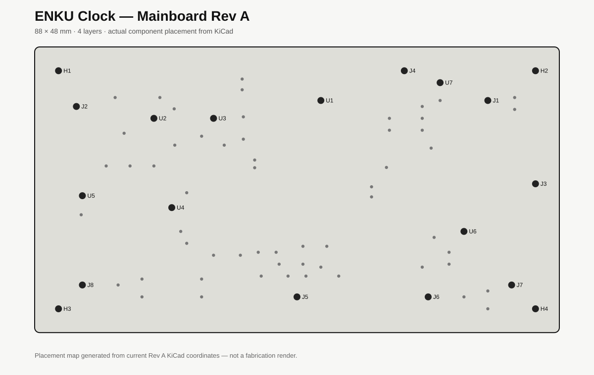
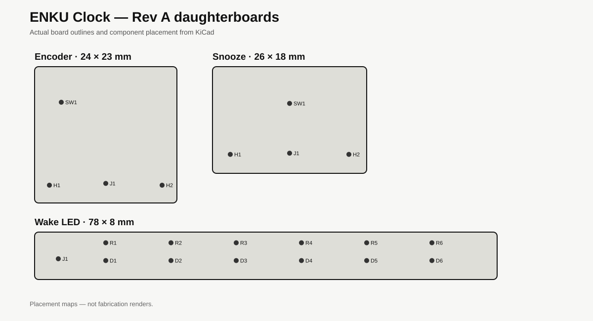
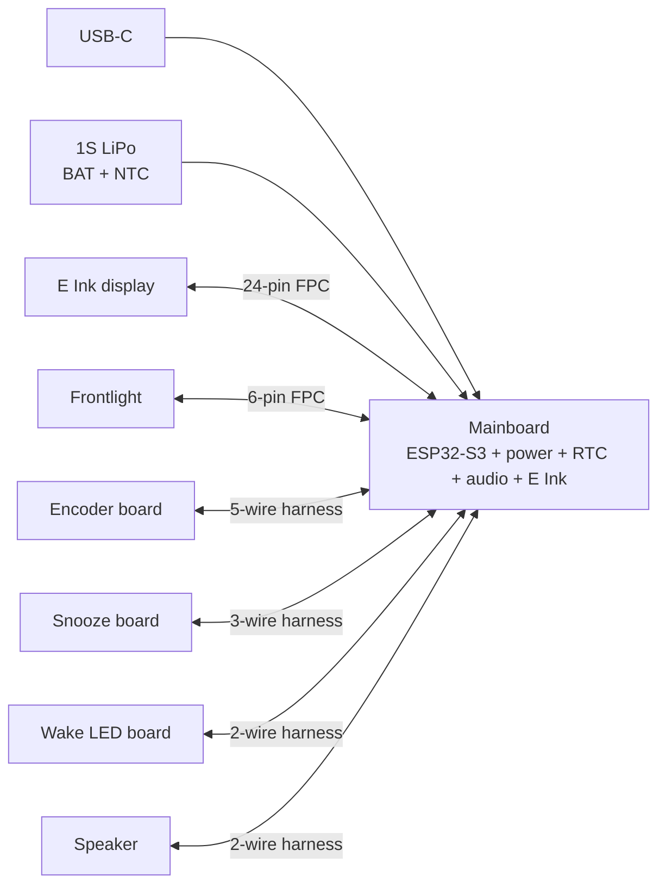

# ENKU Clock

Open, repairable, local-first e-paper alarm clock.

ENKU Clock is a compact ambient clock built around an e-paper display, physical controls and a warm wake-light. It is designed to work without subscriptions, advertisements or a mandatory cloud service.

## Status

**Rev A hardware — PCBWay DFM / prototype review**

The Rev A electronics set contains four PCBs:

| Board | Size | Layers | Status |
|---|---:|---:|---|
| Mainboard | 88 × 48 mm | 4 | Rev A validated, prototype package submitted |
| Encoder board | 24 × 23 mm | 2 | Rev A validated |
| Snooze board | 26 × 18 mm | 2 | Rev A validated |
| Wake LED board | 78 × 8 mm | 2 | Rev A validated |

The current revision has passed native KiCad manufacturing checks with zero hard DRC violations and zero unconnected items before prototype submission.

## Rev A hardware





## Design goals

- local-first operation
- no subscription or mandatory cloud account
- e-paper primary display
- physical rotary control and Snooze button
- warm wake-light
- repairable distributed-board construction
- documented connectors and service access
- replaceable external modules where practical
- open hardware and firmware development

## System overview



The distributed layout keeps user controls and lighting mechanically independent from the Mainboard, improving serviceability and enclosure freedom.

## Hardware

The system is split into four boards:

- **Mainboard** — ESP32-S3, USB-C, battery charging and power path, RTC, ambient-light sensor, audio, e-paper interface and lighting control.
- **Encoder board** — side rotary control.
- **Snooze board** — top physical Snooze control.
- **Wake LED board** — independent warm-light LED board.

### Mainboard highlights

- ESP32-S3-WROOM-1
- USB-C
- BQ24074 charger / dynamic power path
- TPS62840 3.3 V regulator
- RV-3028-C7 RTC
- VEML7700 ambient-light sensor
- MAX98357A I2S amplifier
- external E Ink booster/interface
- service connectors for distributed controls and lighting

## Repository layout

```text
hardware/
  mainboard/          Mainboard KiCad PCB and manufacturing data
  daughterboards/     Encoder, Snooze and Wake LED boards
  schematics/         Rev A schematic sources
  libraries/          Project KiCad symbols and footprints
  assembly/           BOM data
docs/
  README.md
  architecture.md
  connectors.md
  mechanical-interface.md
  manufacturing.md
  bringup.md
  release-checklist.md
  repairability.md
  status.md
.github/
  ISSUE_TEMPLATE/
  workflows/
```

## Manufacturing

Rev A is currently under PCBWay prototype DFM / sourcing review. Production files are generated from the checked KiCad sources rather than maintained as hand-edited manufacturing files.

For the Mainboard, the baseline fabrication target is:

- 4-layer FR-4
- 1.6 mm
- 1 oz outer / inner copper
- ENIG
- L2 continuous GND reference
- L3 power / utility distribution
- filled/capped via-in-pad where explicitly required for SMT assembly

See [docs/manufacturing.md](docs/manufacturing.md).

## Documentation

- [Documentation index](docs/README.md)
- [Architecture](docs/architecture.md)
- [Connectors and GPIO](docs/connectors.md)
- [Mechanical interface](docs/mechanical-interface.md)
- [Manufacturing](docs/manufacturing.md)
- [Rev A bring-up checklist](docs/bringup.md)
- [Release checklist](docs/release-checklist.md)
- [Repairability](docs/repairability.md)
- [Project status](docs/status.md)

## Repairability

ENKU Clock uses separate boards for controls and lighting so service parts can be replaced independently. Connectors, polarity and functional interfaces are documented wherever practical.

See [docs/repairability.md](docs/repairability.md).

## Firmware

Firmware will live in this repository as the Rev A bring-up stabilizes. The first firmware milestone is a hardware bring-up image covering power, USB, RTC, ambient-light sensing, controls, audio, E Ink and lighting.

## Project stage

This is prototype hardware. Files may still change after DFM review and physical Rev A validation.

## License

The project is intended to be open source. Final hardware/firmware license files will be added before the first tagged public release.
